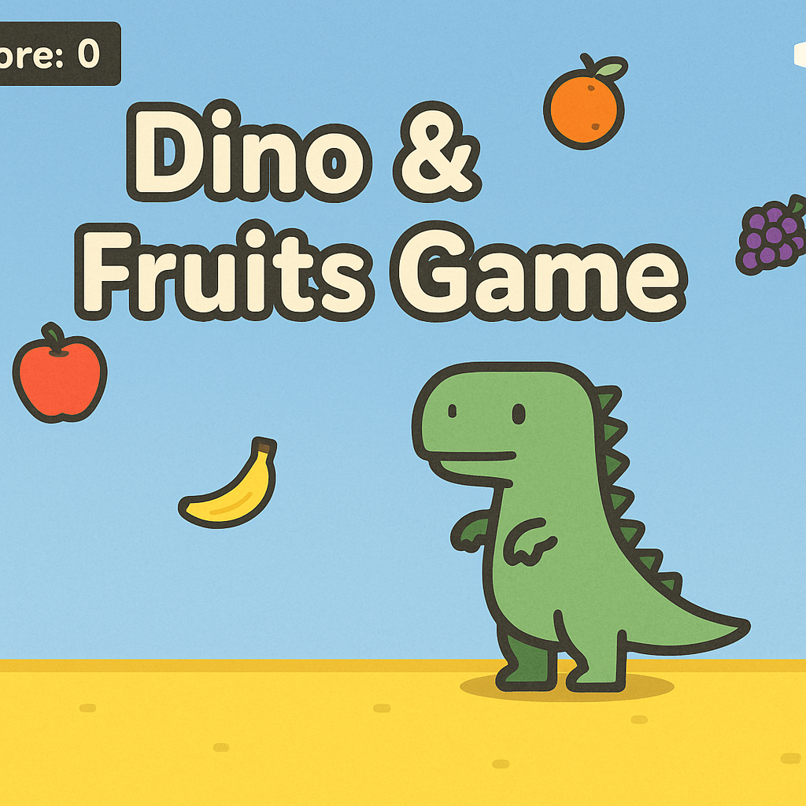

# 🦖 Dino & Fruits Game

> 🎮 HTML5 小恐龙躲水果游戏 | 带护盾道具、冲刺技能、三条命、最高分存档、BGM 和音效。  
> 💻 支持电脑键盘与手机触控操作，可部署到 GitHub Pages 直接在线试玩。纯前端实现，无需安装。

---

## 📌 游戏简介
在这个游戏中，你将操控一只可爱的小恐龙 🦖  
躲避天上掉落的各种水果 🍎🍌🍊🍇🍉，  
拾取绿色护盾道具获得短暂无敌，按下 **Shift** 发动冲刺穿透障碍，挑战更高分！

---

## 🎯 游戏特色
- **护盾道具**：拾取后 5 秒内免疫碰撞
- **冲刺技能**：Shift 短暂加速穿透水果（3 秒冷却）
- **三条生命**：掉血后 1.2 秒无敌
- **最高分存档**：浏览器本地保存
- **BGM + 音效**：背景音乐与打击/得分提示
- **全平台支持**：PC 键盘、手机触控

---

## 🎮 操作方法
**电脑**
- ← → 或 A / D：移动
- Shift：冲刺
- 空格：暂停 / 继续
- R：重开

**手机**
- 触屏左右拖动移动
- 界面按钮暂停/静音

---

## 🚀 在线试玩
部署到 **GitHub Pages** 或 **Netlify** 即可直接在线玩。

### GitHub Pages 部署
1. 上传 `index.html` 到公共仓库
2. `Settings → Pages → Branch: main / Folder: /(root)`
3. 保存并等待 1 分钟
4. 打开 `https://用户名.github.io/仓库名/`

### Netlify 部署
1. 打开 [Netlify Drop](https://app.netlify.com/drop)
2. 拖入 `index.html` 或 ZIP 压缩包
3. 获得在线试玩链接

---

## 📸 游戏封面

---

## 🛠 技术栈
- HTML5 Canvas
- JavaScript (Vanilla JS)
- CSS3
- Web Audio API（BGM & 音效）

---

## 📄 License
本项目采用 MIT 协议，你可以自由修改与分发，但请保留原作者信息。
